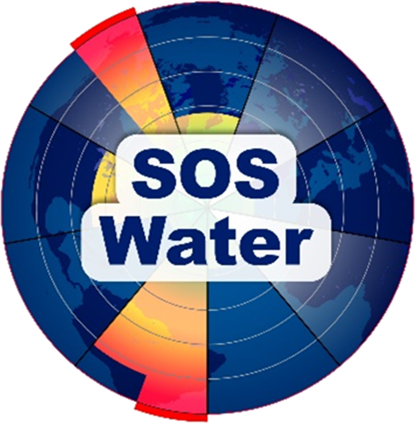

#  SOS-Water - WP3 Earth Observation

This repository is a collection of the code contributions to the Work Package 3 - Earth Observation of SOS-Water - "Water Resources System Safe Operating Space in a Changing Climate and Society" ([DOI:10.3030/101059264](https://cordis.europa.eu/project/id/101059264)). 

SOS-Water is a EU-funded project, started in October 2022, which aims to define a safe operating space (SOS) for the water resources, accounting concurrently for all relevant water dimensions across multiple sectors and spatial scales under the influence of socio-economic, policy, technological, and climatic changes.

This framework aims to operationalize and downscale the global freshwater SOS to the continental and river basin levels, by integrating water system models (WSMs) in five different case studies in Europe and abroad.

Check out the project website at [sos-water.eu](https://sos-water.eu) for more information.

## List of Code Repositories
<!-- Maintainer links -->
[Eawag]: https://www.eawag.ch/en/department/surf/main-focus/remote-sensing/ "Eawag"
[FutureWater]: https://www.futurewater.eu/projects/water-resources-system-safe-operating-space-in-a-changing-climate-and-society-sos-water/ "FutureWater"

<!-- Table 1 -->
Table 1. Code repositories part of deliverables
| **Deliverable** | **Repository** | **Description** | **Maintainer** | **Documentation** |
|-----------------|----------------|-----------------|----------------|---------------------|
| D3.2 | [EOP1: SPM Mapper](https://github.com/mibrechb/SOSW_EOP1) | EO tool for suspended sediment estimation | [Eawag] | [📄](# "Not yet available") |
| D3.2 | [EOP2: Lake and River ice mapper](https://github.com/mibrechb/SOSW_EOP2) | EO tool for extraction of ice coverage and phenology | [Eawag] | [📄](# "Not yet available") |
| D3.2 | [EOP3: Satellite-based altimetry](https://github.com/FutureWater/SOSW_EOP3-SWOT-based-altimetry)| EO tool for water level estimation | [FutureWater] | [📄](# "Not yet available") |
| D3.2 | [EOP4: Surface water temperature mapper](https://github.com/mibrechb/SOSW_EOP4) | EO tool for extraction of surface water temperature | [Eawag] | [📄](# "Not yet available") |
| D3.2 | [EOP5: Crop water productivity mapper](https://github.com/FutureWater/SOSW_EOP5) | EO tool for estimation of crop water productivity | [FutureWater] | [📄](# "Not yet available") |
<!-- | D3.2 | [EOP6: Snow-water-equivalent downscaling](# "Not yet available") | EO tool for downscaling of SWE | [FutureWater] | [📄](# "Not yet available") | -->

<!-- Table 2 -->
Table 2. Other code repositories part of the project
| **Task** | **Repository** | **Description** | **Maintainer** |
|----------|----------------|-----------------|----------------|
| T3.1 | [Data inventory](https://github.com/mibrechb/SOSW_data_inventory) | Inventory of meta-data for project-relevant dataset (part of deliverable 3.1) | [Eawag] |
| T3.2 | [MRC Data Portal Web scraper](https://github.com/mibrechb/SOSW_MRC_webscraper) | Tool to extract datasets from MRC Data Portal | [Eawag] |
| T3.2 | [Global lake water quality assessment](# "Not yet available") | Notebooks to assess data availability from ESA CCI Lakes and Copernicus LWQ | [Eawag] |

## Disclaimer
Views and opinions expressed are those of the author(s) only and do not necessarily reflect those of the European Union or CINEA. Neither the European Union nor the granting authority can be held responsible for them.

## Acknowledgement of funding
<table style="border: none;">
  <tr>
    <td></td>
    <td>This project has received funding from the European Union’s Horizon Europe research and innovation programme under grant agreement No 101059264.</td>
  </tr>
</table>

